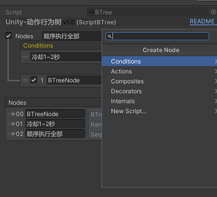

# InheriBT 
- clone from https://gitee.com/zouhunter/scriptable-behaviour-tree
- copy right zouhunter@126.com

## Scriptable Editor Supported

## Graph Editor Supported

## Variant Supported

## SubTree As Node Supported

## Runtime Execute View Supported

